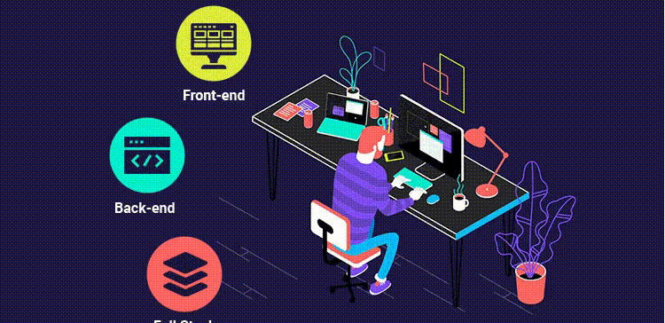

<h1 align="center">Hi,👋 Welcome My Github Profile.</h1>

 
  
  
  
  
<h2 style="border: none; font-weight: bold;">Links</h2>
  

    <a href="https://linktr.ee/dakshkishore" target="blank">Linktree website</a>

  
  
  
  
 

<h2 align="left">Languages and Tools</h2>

  
  
  
  
  
  
  
  
  
  
  
  
  
  
  
  
  

 

  

 
  
  
  
  
<h2>About Me</h2>
  

>Hello! My name is Daksh Kishore, and I reside in Pakistan. I am a professional Front End Web Developer for the past few years.
  
>I began my journey in the field of web development, and since then, I have been advancing while building new knowledge and skills in it. For me, each project is a new opportunity to face new challenges, find new solutions, and learn a new.
  
>I believe that the combination of technology's power and creativity is what gives birth to a strong website or web application. I am interested in understanding new trends in it and incorporating them into my projects.

>You can visit Repositry for my projects. I am eager to face new challenges and seek opportunities to contribute to new endeavors.

  
  

      
 

  
  
  

  

